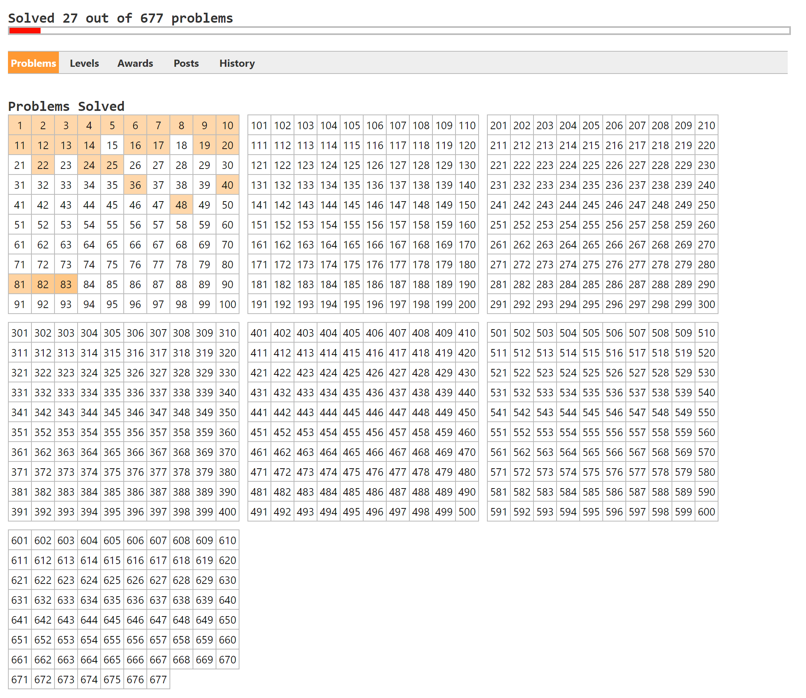

# Project-Euler
_My solutions to the popular problems_

---

## About

This repository is dedicated to my solutions to some of the popular "Project-Euler" tasks.
Until now, I have only used Python for writing these scripts, however, I might switch to
a different language every now and then.

Furthermore, I have solved some other exercises, however, the solutions to them are not
included in this repository, since I coded them as part of a school project.

## Progress

_My current progress_

---

... MattMoony (August, 2019)